# Bevy components

This [Blender addon](https://github.com/kaosat-dev/Blender_bevy_components_workflow/tree/main/tools/bevy_components)  gives you an easy to use UI to add and configure your [Bevy](https://bevyengine.org/) components inside Blender !

- **automatically generates a simple UI** to add/configure components based on a **registry schema** file (an export of all your Bevy components's information, generated)
by the [bevy_registry_export](https://crates.io/crates/bevy_registry_export) crate/plugin
- no more need to specify components manually using custom_properties, with error prone naming etc
- adds **metadata** to objects containing information about what components it uses + some extra information
- uses Blender's **PropertyGroups** to generate custom UIs & connects those groups with the custom properties so that no matter the complexity
of your Bevy components you get a nicely packed custom_property to use with ...
- the ideal companion to the [gltf_auto_export](https://github.com/kaosat-dev/Blender_bevy_components_workflow/tree/main/tools/gltf_auto_export) to embed your Bevy components inside your gltf files
<!-- - adds the ability to **toggle components** on/off without having to remove the component from the object -->


> Important: 
  the tooling is still in the early stages, even if it is feature complete : use with caution!.

> IMPORTANT !! if you have previously used v0.1 , v0.2 had a breaking change, please see [this](#regenerate-ui-values) section on how to upgrade your data to v0.2.\
This problem should not be present going forward

> IMPORTANT !! if you have previously used v0.2 , v0.3 had a breaking change, please see [this](#regenerate-custom-property-values) section on how to upgrade your data to v0.3.

## Installation: 

* grab the latest release zip file from the releases tab (choose the bevy_components releases !)

<!---->

* in Blender go to edit =>  preferences => install

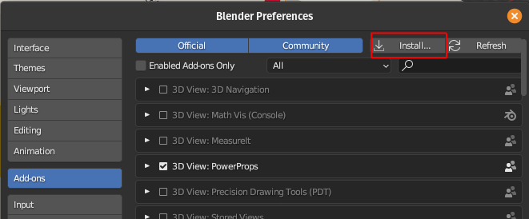

* choose the path where ```bevy_components.zip``` is stored


## Configuration & overview

Before you can use the add-on you need to configure it

### Bevy side

 - setup [bevy_registry_export](https://crates.io/crates/bevy_registry_export) for your project (see the crate's documentation for that), and compile/run it to get the ```registry.json``` file

### Blender side

- Go to the new Bevy Components tab in the 3D view

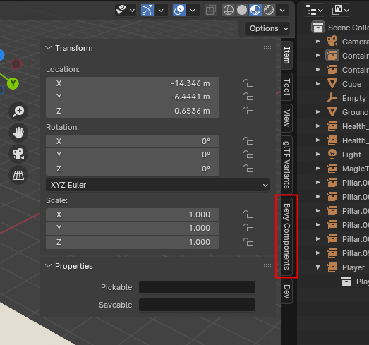

- click on the button to select your registry.json file (in the "configuration" panel)

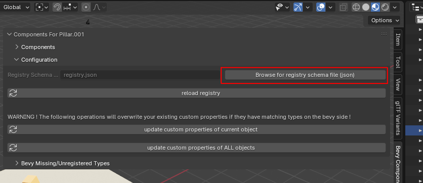

- the list of available components will appear


 #### registry file polling


  * by default, the add-on will check for changes in your registry file every second, and refresh the UI accordingly
    * you can set the polling frequency or turn it off if you do not want auto-refresh

    


## Use


### Existing components & custom properties

* If you already have components defined manualy in Blender inside **custom properties** you will need to define them again using the UI!
* avoid mixing & matching: if you change the values of **custom properties** that also have a component, the custom property will be **overriden** every time
you change the component's value
* you can of course still use non component custom properties as always, this add-on will only impact those that have corresponding Bevy components

### adding components

- to add a component, select an object and then select the component from the components list: (the full type information will be displayed as tooltip)


- click on the dropdown to get the full list of available components

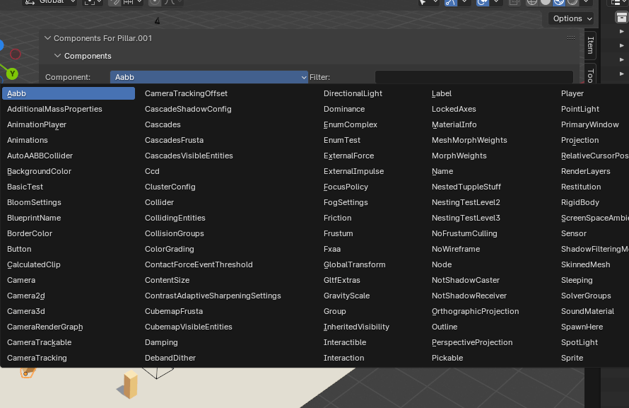

- you can also filter components by name for convenience


- add a component by clicking on the "add component" button once you have selected your desired component
  
  it will appear in the component list for that object


### edit components

- to edit a component's value just use the UI: 


it will automatically update the value of the corresponding custom property


### Create components from custom properties

- IF you have a valid component type  and the correct corresponding RON string in the custom_property value (this button will not appear if not), this add-on can automatically
generate the corresponding component for you:

- Fill/check your custom property (here for Aabb) 


- click on the button


-voila !


### copy & pasting 

- you can also copy & paste components between objects

- click on the "copy component button" of the component you want to copy


- then select the object you want to copy the component (& its value) to, and click on the paste button.

It will add the component to the select object

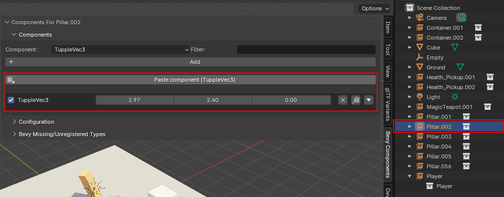

> if the target object already has the same component, its values will be overwritten


## Additional components UI features

- for large/ complex components you can toggle the details of that component:

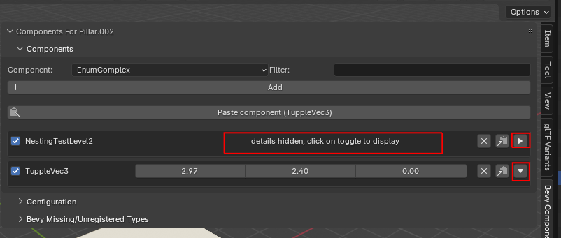


## Supported components

- normally (minus any bugs, please report those!) all components using **registered** types should be useable and editable
- this includes (non exhaustive list):
  * enums (even complex ones !)

    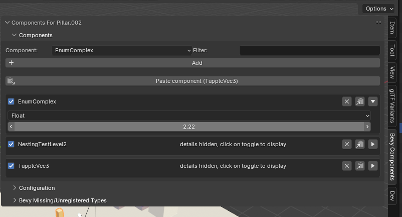

    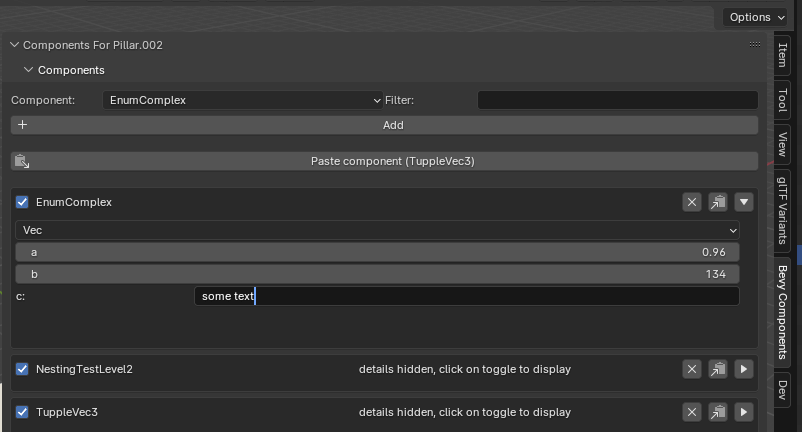

  
  * complex structs, with various types of fields (including nested ones)

    

  * lists/ vecs (here a vec of tuples)

    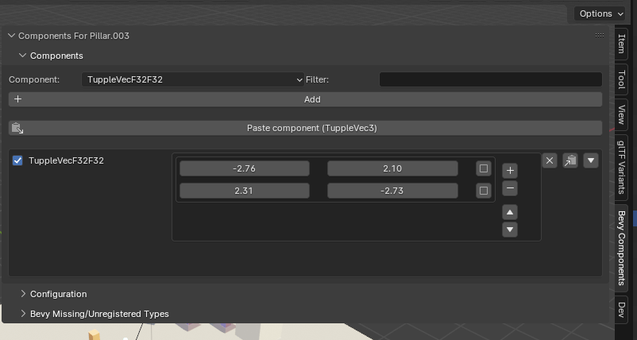

  * etc !

## Unregistered types & error handling

- non registered types can be viewed in this panel : (can be practical to see if you have any missing registrations too!)

    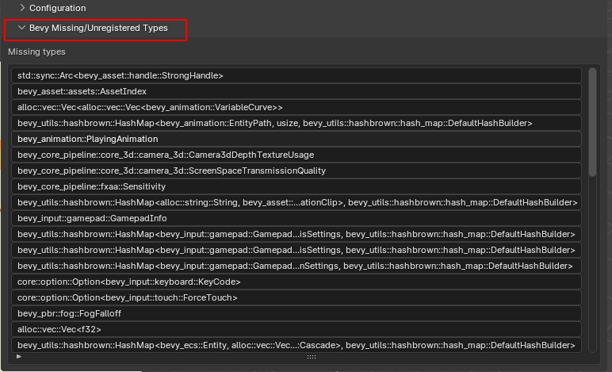

- if you have a component made up of unregistered structs/enums etc, you will get visual feedback & the component will be deactivated

    

  > see [here](#invalidunregistered-type-renaming--conversion) for ways to convert invalid / unregistered components to other types.


- if you are encountering this type of view: don't panic your component data is not gone ! It just means you need to reload the registry data by clicking on the relevant button

    

  

## Advanced Tools

In this section you will find various additional more advanced tooling

### Invalid/unregistered type renaming / conversion

If you have components that are
  * invalid : ie some error was diagnosed
  * unregistered: a custom property is present on the object, but there is no matching type in the registry

Here you will get an overview, of ALL invalid and unregistered components in your Blender project, so you can find them, rename/convert them,
or delete them, also in bulk

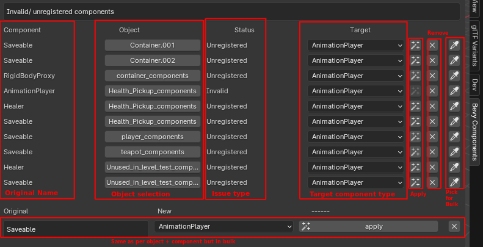

* you can click on the button to select the object in your outliner (this also works across scenes, so you will be taken to the scene where the
given object is located)


#### Single object component renaming/ conversion

  - to rename/convert a single component for a single object:
    
    * go to the row of the object you want to convert the component of
    * in the dropdown menu, choose the target component
    * click on the button with the magic wand to convert the component

       

  > the tool will attempt to automatically convert the source component, including the field names/values, if the target component has the same ones
    If it fails to do the conversion, you will get an error message, and you will either have to change the custom property yourself, or you can simply
    change the values in the UI, which will automatically generate the custom property value

  - to delete a single component for a single object:

    * go to the row of the object you want to remove the component from
    * click on the button with the "x" to remove the component  

       

#### Bulk component renaming/ conversion

  - use this method if you want to convert ALL components of a given type of ALL objects 

    * click on this button to pick your source component

      

    * for conversion: in the dropdown menu, choose the target component & click apply to convert all matching components
    * for deletion: clic on the "x" to remove all matching components

      


 ### For conversion between custom properties & components & vice-versa

 #### regenerate custom property values

  - "update custom properties of current object" : will go over **all components** that you have defined for the **currently selected object**, and re-generate the 

    corresponding custom property values 

     


  - "update custom properties of ALL objects" : same as above but it will do so for the **ALL objects in your blend file** (so can be slow!), and re-generate the 

    corresponding custom property values 

     

     > IMPORTANT !! use this if you have previously used v0.1 or v0.2 , as v0.3 had a breaking change, that makes it **necessary** to use this **once** to upgrade components data
     You should also re-export your gltf files , otherwise you might run into issues

  
  #### regenerate component/ UI values

   - since v0.2, you have the option to regenerate (for the selected object or all objects, as above) to regenerate your UI values from the custom property values

   

   > IMPORTANT !! use this if you have previously used v0.1 , as v0.2 had a breaking change, that makes it **necessary** to use this **once** to upgrade the UI data


## Additional important information


- for the components to work correctly with [```bevy_gltf_components```](https://crates.io/crates/bevy_gltf_components) or [```bevy_gltf_blueprints```](https://crates.io/crates/bevy_gltf_blueprints) you will need to set the ```legacy_mode``` for those plugins to **FALSE**
as the component data generated by this add on is a complete, clean **ron** data that is incompatible with the previous (legacy versions).
Please see the documentation of those crates for more information.

> Note: the legacy mode support will be dropped in future versions, and the default behaviour will be NO legacy mode


## Examples

you can find an example [here](https://github.com/kaosat-dev/Blender_bevy_components_workflow/tree/main/examples/bevy_registry_export/)

## Known issues & limitations:

* **Range** data (ie ```Range<f32>``` etc) are not handled at this time (issue seems to be on the Bevy side)
* **Entity** structs are always set to 0 (setting entity values on the Blender side at this time does not make much sense anyway) 

## License

This tool, all its code, contents & assets is Dual-licensed under either of

- Apache License, Version 2.0, ([LICENSE-APACHE](../LICENSE_APACHE.md) or https://www.apache.org/licenses/LICENSE-2.0)
- MIT license ([LICENSE-MIT](../LICENSE_MIT.md) or https://opensource.org/licenses/MIT)