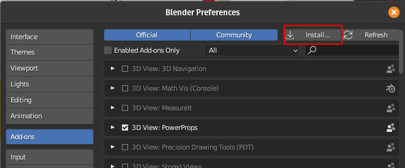
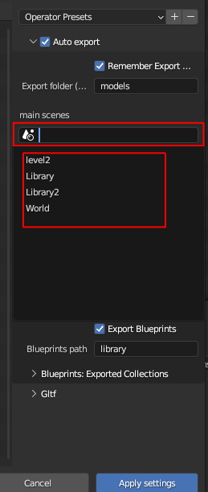
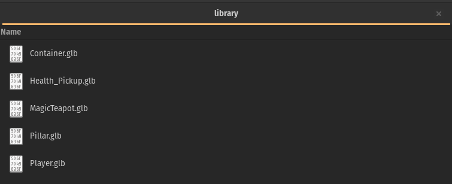
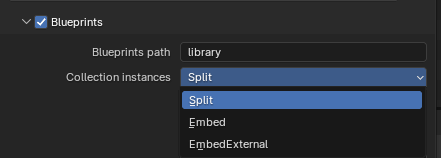
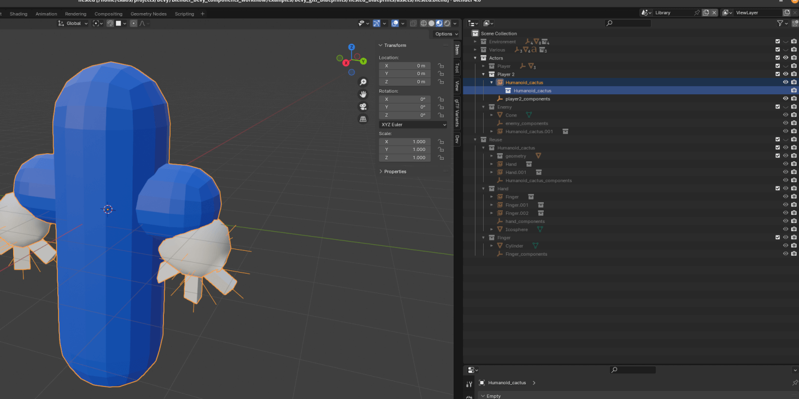
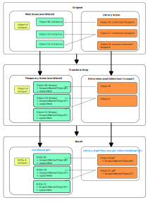

# gltf_auto_export

This [Blender addon](./)  
- automatically exports your level/world from Blender to gltf whenever you save your Blend file.
- in Blueprints mode (highly recommended !) : 
    - supports automatic exports of used collections as [Gltf blueprints](../../crates/bevy_gltf_blueprints/README.md)
    - supports any number of main/level scenes 
        - Blender scenes where you define your levels, and all collection instances are replaced with "pointers" to other gltf files (all automatic)
    - supports any number of library scenes
        - Blender scenes where you define the assets that you use in your levels, in the form of collections
    - automatic export of **changed** objects & collections only ! a sort of "incremental export", where only the changed collections (if in use)
        get exported when you save your blend file
   

## Installation: 


* grab the latest release zip file


* in Blender go to edit =>  preferences => install



* choose the path where ```gltf_auto_export.zip``` is stored


## Usage: 

> ***IMPORTANT***

if you have used a version of this add-on prior to v0.9, there was an issue that kept generating orphan (junk) data on every save !
You can easilly clean up that data 

- go to orphan data:


- click on purge


- validate


This issue has been resolved in v0.9.


### Basics

* before it can automatically save to gltf, you need to configure it
* go to file => export => gltf auto export


* set the autoexport parameters  in the **auto export** panel: 

    


    - export folder: root folder to export models too
    - export scene settings: exports "global"/scene settings like ambient color, bloom, ao, etc 
        
        This automatically generates additional components at the scene level 

    - pick your main (level) scenes and/or library scenes (see the chapter about [Blueprints](#blueprints) and [multiple Blend filles workflow](#multiple-blend-file-workflow) below)   
        - click in the scene picker & select your scene

        

        - click on the "+" icon

        

        - your scene is added to the list
        
         

    - export blueprints: check this if you want to automatically export blueprints (default: True)
    - blueprints path: the path to export blueprints to , relative to the main **export folder** (default: library)
    - collection instances: select which option you want to use to deal with collection instances (aka combine mode) (both inside blueprint collections & main collections)

        * split (default, highly recomended) : the addon will 'split out' any nested collections/ blueprints & export them
        * embed: choose this option if you want to keep everything inside a gltf file (less efficient, not recomended)
        * embedExternal: this will embed ONLY collection instances whose collections have not been found inside the current blend file

        These options can also be **overridden** on a per collection instance basis: (if you want to split out most collection instances, but keep a few specific ones embeded
        inside your gltf file)
            
         

        - simply add a custom property called **_combine** to the collection instance, and set it to one of the options above

        please read the dedicated [section](#collection-instances--nested-blueprints) below for more information


    - Export dynamic and static objects seperatly : For MAIN scenes only (aka levels), toggle this to generate 2 files per level: 

        - one with all dynamic data: collection or instances marked as dynamic (aka saveable)
        - one with all static data: anything else that is NOT marked as dynamic, the file name will have the suffix **_dynamic**

        Ie if you add a "Dynamic" custom property/ component to either your collection instances or your blueprint, you get a clean seperation between 

        - your static level data (anything that will never change during the lifetime of your Bevy app)
        - your dynamic objects (anything that will change during the lifetime of your Bevy app, that can be saved & reloaded in save files for example)

    - export materials library: check this if you want to automatically export material libraries (default: False)
    please read the dedicated [section](#materials) below for more information

        > This only works together with blueprints !

    - materials path: where to export materials to

    - Legacy mode for bevy: the export of custom properties is slightly different
       when using bevy_gltf_components or bevy_gltf_blueprints with ```legacy_mode``` turned on (the default currently), toggle this on to keep using the older variant
       
       > tldr: legacy mode in this add on should match your use of legacy mode on the Bevy side
       > if you use the ```bevy_components``` add-on **legacy mode** should be turned **OFF**

* and your standard gltf export parameters in the **gltf** panel

    


* click on "apply settings"
* now next time you save your blend file you will get an automatically exported gltf file (or more than one, depending on your settings, see below)

### Blueprints

You can enable this option to automatically replace all the **collection instances** inside your main scene with blueprints
- whenever you change your main scene (or your library scene , if that option is enabled), all your collection instances 
    * will be replaced with empties (this will not be visible to you)
    * those empties will have additional custom properties / components : ```BlueprintName``` & ```SpawnHere```
    * your main scene/ level will be exported to a much more trimmed down gltf file (see next point)
    * all the original collections (that you used to create the instances) will be exported as **seperate gltf files** into the "library" folder

- this means you will have 
    * one small main gltf file (your level/world)
    * as many gltf files as you have used collections in the main scene , in the library path you specified :
    for the included [basic](../../examples/bevy_gltf_blueprints/basic/) example's [assets](../../examples/bevy_gltf_blueprints/basic/assets/), it looks something like this: 

    
    
    the .blend file that they are generated from can be found [here](../../examples/bevy_gltf_blueprints/basic/assets/advanced.blend)

- the above only applies to collections that have **instances** in your main scene!
    if you want a specific collection in your library to always get exported regardless of its use, you need to add 
    a **COLLECTION** (boolean) custom property called ```AutoExport``` set to true
    > not at the object level ! the collection level !

    

    It will get automatically exported like any of the "in-use" collections.

- you can also get an overview of all the exported collections in the export menu

    

- there are some workflow specificities for multi blend file [workflows](#multiple-blend-file-workflow)

#### Collection instances & Nested blueprints

To maximise reuse of meshes/components etc, you can also nest ***collections instances*** inside collections (as normally in Blender), but also export each nested Blueprint as a seperate blueprints.

> Don't forget to choose the relevant option in the exporter settings (aka **"split"**)

> This replaces the previous "export nested blueprints" checkbox/ option




- To make things clearer: 

    

    - **Player2** & **Enemy** both use the **Humanoid_cactus** nested collection/blueprint, so **Humanoid_cactus** gets exported as a Blueprint for re-use ...but
    - **Humanoid_cactus** is also made up of a main mesh & two instances of **Hand** , so **Hand** gets exported as a Blueprint for re-use ...but
    - **Hand** is also made up of a main mesh & three instances of **Finger**, so **Finger** gets exported as a Blueprint for re-use

- The exported models in this case end up being:

    

    - Note how **Player2.glb** is tiny, because most of its data is actually sotred in **Humanoid_cactus.glb**
    - **Enemy.glb** is slightly bigger because that blueprints contains additional meshes
    - All the intermediary blueprints got exported automatically, and all instances have been replaced with "empties" (see explanation in the **Process section** ) to minimize file size

- Compare this to the output **WITHOUT** the nested export option:

    

    - less blueprints as the sub collections that are not in use somewhere directly are not exported
    - **Player2.glb** & **Enemy.glb** are significantly larger


TLDR: smaller, more reuseable blueprints which can share sub-parts with other entities !

### Materials

You can enable this option to automatically generate a **material library** file that combines all the materials in use in your blueprints.


Since each blueprint is normally a completely independant gltf file, without this option, if you have a material with a large texture for example, 
**ALL** of your blueprints using that material will embed that large texture, leading to **significant bloat & memory use**.


- When this option is enabled, you get a single material library per Blender project, and a **MaterialInfo** component is inserted into each object using a material.
- The correct material will then be inserted on the Bevy side (that loads any number of material libraries that you need) into the correct mesh (see the configuration
options in **bevy_gltf_blueprints** for more information on that)
- Only one material per object is supported at this stage, ie the last material slot's material is the one that is going to be used


TLDR: Use this option to make sure that each blueprint file does not contain a copy of the same materials 


### Multiple blend file workflow

If you want to use multiple blend files, use Blender's asset library etc, we got you coverred too !
There are only a few things to keep in mind 

#### Assets/library/blueprints files
- mark your library scenes as specified above, but **do NOT** specify a **main** scene
- mark any collection in your scenes as "assets" (more convenient) or add the "AutoExport" custom property to the collection
- choose "split" for the combine mode (as you want your gltf blueprints to be saved for external use)
- do your Blender things as normal
- anytime you save your file, it will automatically export any relevant collections/blueprints
- (optional) activate the **material library** option, so you only have one set of material per asset library (recomended)

#### Level/world files
- mark your main scenes as specified above, but **do NOT** specify a **library** scene
- configure your asset libraries as you would usually do , I recomend using the "link" mode so that any changes to asset files are reflected correctly
- drag & drop any assets from the blueprints library (as you would normally do in Blender as well)
- choose "split" for the combine mode (as you want your gltf blueprints to be external usually & use the gltf files generated from your assets library)
- do your Blender things as normal
- anytime you save your file, it will automatically export your level(s)


Take a look at the [relevant](../../examples/bevy_gltf_blueprints/multiple_levels_multiple_blendfiles/) example for more [details](../../examples/bevy_gltf_blueprints/multiple_levels_multiple_blendfiles/art/) 


### Internal Process overview

This is the internal logic of the export process with blueprints (simplified)



ie this is an example scene...


and what actually gets exported for the main scene/world/level


all collections instances replaced with empties, and all those collections exported to gltf files as seen above


## Development 

- since the code has now been split up into multiple modules, to make your life easier, I highly recomend (if you are using vscode like me) to use 
[this](https://marketplace.visualstudio.com/items?itemName=JacquesLucke.blender-development) excellent extension , works easilly and fast , even for the latest 
versions of Blender (v4.0 as of this writing)
- this [article](https://polynook.com/learn/set-up-blender-addon-development-environment-in-windows) might also help out 
(easy enough to get it working on linux too)

## License

This tool, all its code, contents & assets is Dual-licensed under either of

- Apache License, Version 2.0, ([LICENSE-APACHE](../LICENSE_APACHE.md) or https://www.apache.org/licenses/LICENSE-2.0)
- MIT license ([LICENSE-MIT](../LICENSE_MIT.md) or https://opensource.org/licenses/MIT)